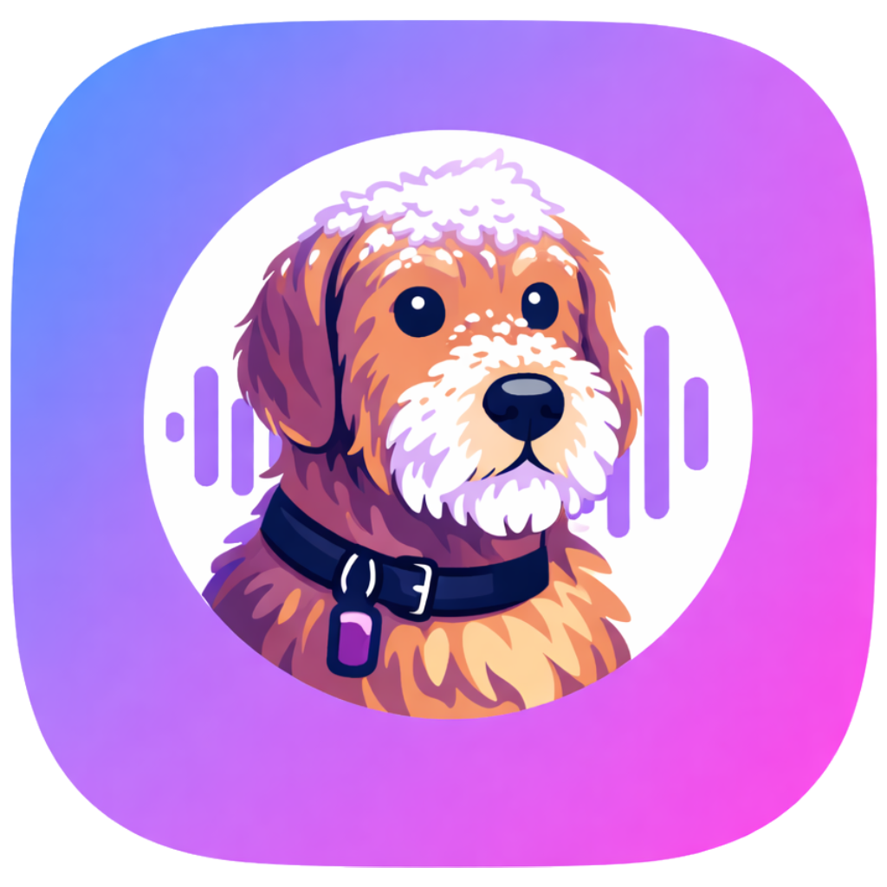

# Mila

## What is Mila?

Mila is your intelligent meeting companion for Mac. It records audio from your system, transcribes it with AI, and helps you never miss what matters in your meetings, calls, and conversations.

Think of Mila as your personal audio assistant that works invisibly in the background. It captures audio from any app on your Mac - Zoom, Teams, Slack, Google Meet, or anything else playing on your system. Then it uses AI to transcribe everything locally on your device, so your recordings stay private and secure.

## Demo Video

Check out Mila in action:

<video width="100%" controls>
  <source src="images/milareel.mov" type="video/mp4">
  Your browser does not support the video tag. You can download the video file directly from the images folder.
</video>

## What Can Mila Do?

### Smart Audio Recording

- Record system audio from any app (Zoom, Teams, Slack, Google Meet, etc.)
- Record microphone input
- Record both system audio and microphone simultaneously
- No bot users joining your calls - Mila captures audio directly from your Mac

### AI Transcription

- Instant transcriptions powered by advanced AI
- Runs completely on your device - no audio sent to external servers
- Fast, accurate, and completely private
- Chat with your recordings using AI to get summaries, find key moments, and extract action items

### Multiple Export Formats

- Export to WAV, MP3, M4A, or FLAC
- Choose the format that works best for your workflow

### Privacy First

- All recordings stored locally on your Mac by default
- No cloud uploads unless you choose
- We never sell your data to third parties
- Delete your data anytime and it's completely erased

### Customizable Workflow

- Set custom hotkeys for recording
- Choose audio sources
- Configure quality settings
- Adapts to how your team works

## Pricing Plans

### Free Plan

- 1 device
- 30 minute recording limit
- MP3 export only

### Premium Plans

Premium includes everything in the free plan, plus:

- Unlimited recording length
- All export formats (WAV, M4A, FLAC, MP3)
- AI transcription
- Priority support

**Volume Pricing:**

- 1 seat: $6/month
- 2 seats: $10/month ($5 per user)
- 3 seats: $14/month ($4.67 per user)
- 5 seats: $20/month ($4 per user)
- 10 seats: $32/month ($3.20 per user)

Need more than 10 seats? Contact us for enterprise pricing.

## How It Works

1. **Sign Up**: Create a free account on the Mila website
2. **Get Your License Token**: After signing up, you get a license token from your dashboard
3. **Activate in Mila**: Paste the token into the Mila macOS app
4. **Start Recording**: Mila activates and you can start recording immediately
5. **Manage Your Subscription**: Upgrade, downgrade, or manage devices through your dashboard anytime

### License Seats

Each license seat equals one Mac device. If you have a 2-seat plan, you can activate Mila on 2 different Macs. Each device stores its recordings locally - they don't sync between devices for privacy.

Once activated, Mila works offline. The app checks in with the server periodically when you're online to keep everything up to date.

## Privacy and Security

Mila is built with privacy as a core principle:

- Recordings stay on your Mac by default
- Transcription happens on your device using local AI
- No audio is sent to external servers unless you explicitly choose cloud features
- All data can be deleted at any time
- We never share or sell your data

Your account and payments are protected with industry-standard security measures to keep your information safe.

## Getting Started

1. Visit the Mila website
2. Sign up for a free account
3. Download the Mila macOS app
4. Get your license token from your dashboard
5. Activate Mila with your token
6. Start recording!

## Support

For questions, support, or feedback:

- Website: https://mila.rocks
- Support email: support@mila.rocks
- Legal inquiries: legal@mila.rocks

---

_Last updated: January 2026_
